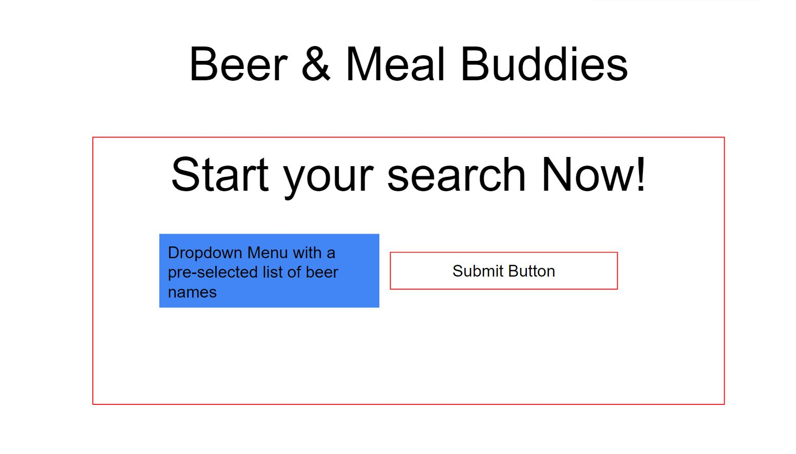
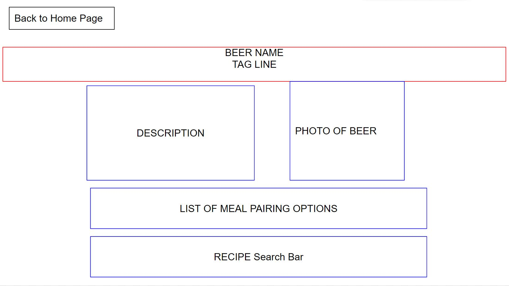
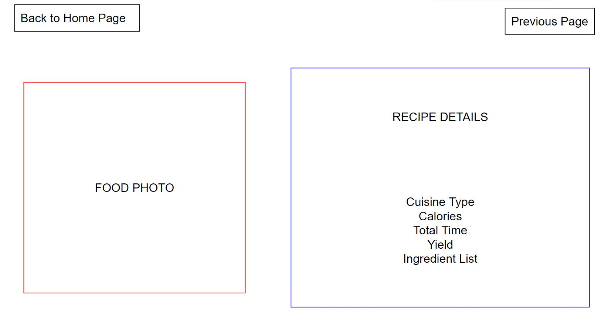

## 
 **🍻Beer Meal Buddies🍳** 

## Overview

Beer Meal Buddies is designed for users who love a good beer! Beer Meal Buddies comes with a recommended list of great beers, upon each selection of beer, it will come with their own perfect meal pairing.

## Technologies

- Vscode
- CSS
- Semantic UI
- HTML
- JavaScript
- APIS
- JQUERY

## Userstory:

1. As a user who loves beer but unsure of what meals to have with it
2. I WANT to see a selection of beers with their description, alongside that I WANT to see possible meal pairings.
3. So THAT I can have an easier time deciding on what to drink and eat.

## Acceptance Criteria:

- Given I am using a beer and meal buddy application
- When I open the application
- Then I am presented with the home page and dropdown list
- When I click on the dropdown list I am presented with a selection of beer
- When I hit the search button
- Then I am redirected to a page where I can see the beer description, photo and possible meal pairings.
- When I decide if I do not like these pairings
- Then I am presented with a search button for other recipes
- When I search for a recipe
- Then i am presented with a picture and recipe instructions

## How Do I Use Beer Meal Buddies?

Beer Meal Buddies is super friendly for all users! Users can navigate through the webpage in just one click! Just scroll down to the drop list and select a beer. Once the beer has been selected then users will be directed to the Beer Page! The Beer Page will include the description and photo of the beer! Hungry? Good news! Not only does Beer Meal Buddies give you info on your selected beer but it also gives a great recommended pairing of food! Not liking what you see? We thought ahead and implemented a recipe search button, users can search anything they’d like and it will redirect them to a new page called “Recipe Page”. The Recipe Page was designed to be simple and eye-catching so users can scroll down and see a list of ingredients, calories, serving sizes and picture of the results!

## Roadmap

Beer Meal Buddies is still a work in progress. There are plans for the future, Beer Meal Buddies will be looking into adding instructions for the meal users look up. The UI will be more polished than ever before. More selections of beers will come.

## Installations

No installations are needed to use Beer Meal Buddies.

## Usage

- [Link to Github Deployment](https://branbao1995.github.io/Beer-Meal-Buddies/index.html)

## Project Wireframe

- Landing Page
  

- Beer Page
  

- Recipe Page
  

## Acknowledgements 

HongDong Bao

- [Github Link](https://github.com/BranBao1995)

Zytka Mateusz

- [Github Link](https://github.com/MateuszZytka)

Diana Vu

- [Github Link](https://github.com/DianasJourney)

## License

MIT License

Copyright (c) 2022 Hongdong Bao

Permission is hereby granted, free of charge, to any person obtaining a copy
of this software and associated documentation files (the "Software"), to deal
in the Software without restriction, including without limitation the rights
to use, copy, modify, merge, publish, distribute, sublicense, and/or sell
copies of the Software, and to permit persons to whom the Software is
furnished to do so, subject to the following conditions:

The above copyright notice and this permission notice shall be included in all
copies or substantial portions of the Software.

THE SOFTWARE IS PROVIDED "AS IS", WITHOUT WARRANTY OF ANY KIND, EXPRESS OR
IMPLIED, INCLUDING BUT NOT LIMITED TO THE WARRANTIES OF MERCHANTABILITY,
FITNESS FOR A PARTICULAR PURPOSE AND NONINFRINGEMENT. IN NO EVENT SHALL THE
AUTHORS OR COPYRIGHT HOLDERS BE LIABLE FOR ANY CLAIM, DAMAGES OR OTHER
LIABILITY, WHETHER IN AN ACTION OF CONTRACT, TORT OR OTHERWISE, ARISING FROM,
OUT OF OR IN CONNECTION WITH THE SOFTWARE OR THE USE OR OTHER DEALINGS IN THE
SOFTWARE.
